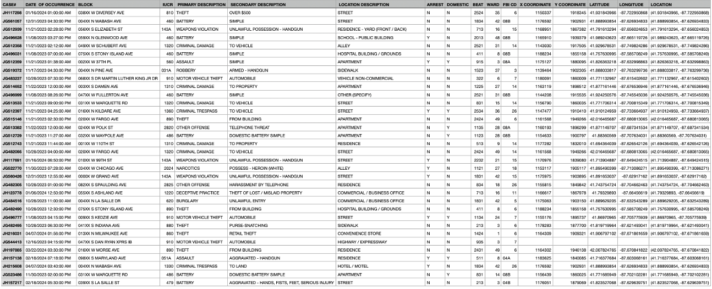
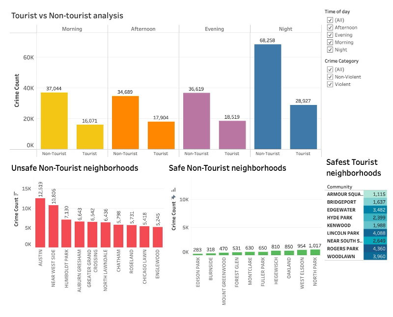
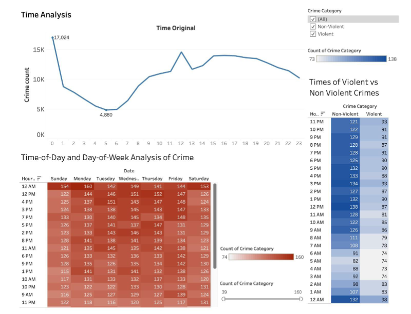
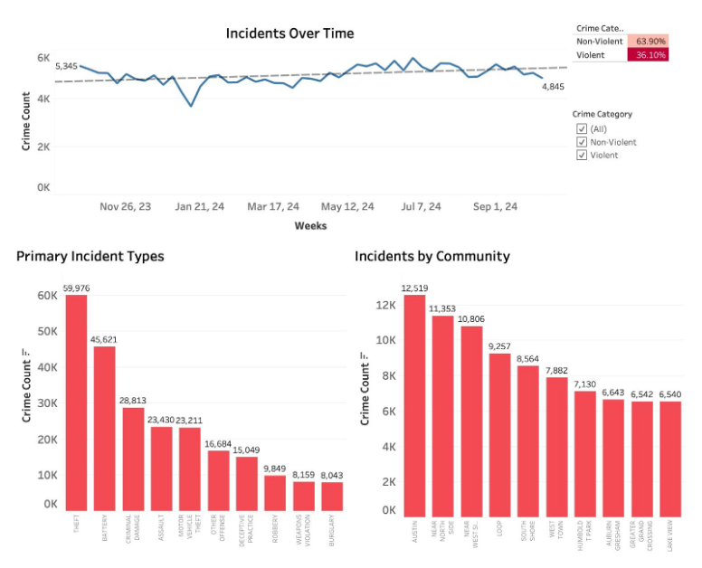
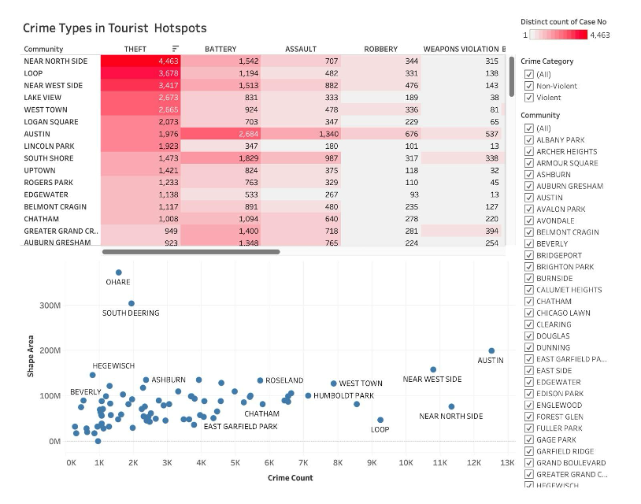

# Chicago Crime Data Analytics for Tourism Support

## 🔎 Project Overview

Chicago is often perceived as a high-crime city, which negatively impacts tourism and local businesses. However, crime patterns vary significantly across neighborhoods and time windows.

This project analyzes one year of Chicago crime incident data to:

* Identify safer neighborhoods
* Detect low-risk time windows
* Compare tourist vs. non-tourist areas
* Provide actionable safety insights for tourism strategy

The goal is to translate raw crime data into business-driven insights that support tourism decision-making .

---

# 🎯 Business Problem

Tourism stakeholders (tourism boards, local businesses, city planners) need:

* Clear identification of safe neighborhoods
* Understanding of peak crime hours
* Insights into common crime types affecting visitors
* Data-backed safety recommendations

This project transforms raw crime data into strategic recommendations using SQL, Python, and Tableau .

---

# 🗂 Dataset

### 📌 Sources

* Chicago Crime Incident Data (258,062 records, 31 features)
* Community Area Boundaries Dataset

### 📌 Key Features

* Crime type (Primary & Secondary Description)
* Timestamp (Date & Time of Occurrence)
* Geographic coordinates
* Arrest status
* Ward & community metadata 

### 📌 Data Overview

---

# 🏗 Data Engineering & Modeling

## 🔹 Relational Data Model (3NF)

The dataset was normalized into **3rd Normal Form (3NF)** to ensure:

* Reduced redundancy
* Data consistency
* Scalability for future expansion

Core entities:

* Cases
* Incident Type
* Case Location
* Location Description
* Community Description 

Why relational instead of dimensional?

* Strong inter-entity relationships
* Efficient read/write operations
* Future database scalability

---

# 🧹 Data Cleaning & Feature Engineering

### ✔ Handling Missing Values

* Missing location descriptions replaced with `"unknown"`
* Missing geographic values preserved for integrity

### ✔ Duplicate Removal

* Removed duplicated rows and repeated case numbers

### ✔ Temporal Feature Engineering

Extracted:

* Year
* Month
* Day
* Day of Week
* Hour

This enabled detailed spatio-temporal analysis .

---

# 🛠 Tools & Technologies

| Tool                   | Purpose                      |
| ---------------------- | ---------------------------- |
| MySQL                  | Data storage & normalization |
| SQL                    | Aggregation & querying       |
| Python (Pandas, NumPy) | EDA & feature engineering    |
| SQLAlchemy             | Automated data import        |
| Tableau                | Interactive dashboards       |

---

# 📊 Exploratory Data Analysis

## 1️⃣ Tourist vs Non-Tourist Area Comparison

Key Findings:

* Tourist areas consistently show lower crime rates across all time windows.
* Morning and afternoon crime counts in tourist areas are less than half of non-tourist areas.
* Nighttime crime spikes significantly in non-tourist neighborhoods .

### 📌 Tableau Visualization

---

## 2️⃣ Temporal Crime Patterns

* High-risk hours: **8 PM – 12 AM**
* Noon (12 PM) shows a noticeable spike
* Lowest crime window: **2 AM – 5 AM**
* Slight weekday elevation in crime counts 

### 📌 Tableau Visualization

---

## 3️⃣ Geographic Hotspots

High-density crime areas:

* Near North Side
* The Loop
* Parts of South Side

Low-crime neighborhoods:

* Edison Park
* Mount Greenwood
* Forest Glen 

### 📌 Tableau Visualization

---

## 4️⃣ Crime Type Distribution

* Theft is the most common crime
* Battery & assault remain significant
* Motor vehicle theft notable
* Burglary & weapons violations comparatively lower 

### 📌 Tableau Visualization

---

# 💡 Business Insights & Recommendations

### ✔ Promote Safer Zones

Highlight:

* O’Hare
* South Deering
* Hegewisch
* Beverly 

### ✔ Optimize Visiting Time

Recommend:

* Morning & afternoon exploration
* Late winter marketing campaigns

### ✔ Security Reinforcement

Increase visibility in:

* The Loop
* Near North Side
* 8 PM – 12 AM window 

---

# 📈 Key Takeaways

* Data normalization significantly improved geospatial insight quality.
* Differentiating tourist vs non-tourist areas revealed critical strategy gaps.
* Visualization simplified complex crime patterns into actionable insights.
* Business-driven analytics strengthens stakeholder decision-making.